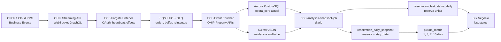
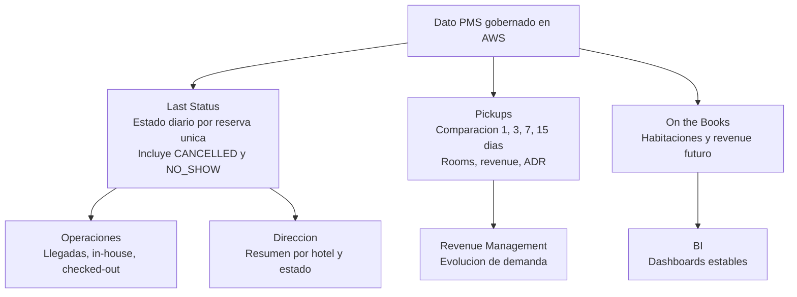
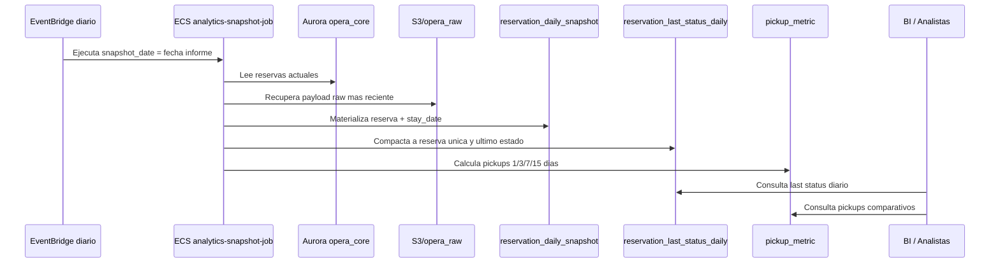

# Diagramas actualizados - OPERA Cloud Analytics con last status

## Arquitectura end-to-end

```mermaid
flowchart LR
    OPERA["OPERA Cloud PMS<br/>Business Events"] --> OHIP["OHIP Streaming API<br/>WebSocket GraphQL"]
    OHIP --> LISTENER["ECS Fargate Listener<br/>OAuth, heartbeat, offsets"]
    LISTENER --> SQS["SQS FIFO + DLQ<br/>orden, buffer, reintentos"]
    SQS --> ENRICHER["ECS Event Enricher<br/>OHIP Property APIs"]
    ENRICHER --> RAW["S3 raw JSON<br/>evidencia auditable"]
    ENRICHER --> CORE["Aurora PostgreSQL<br/>opera_core actual"]
    CORE --> JOB["ECS analytics-snapshot-job<br/>diario"]
    RAW --> JOB
    JOB --> SNAP["reservation_daily_snapshot<br/>reserva + stay_date"]
    JOB --> LAST["reservation_last_status_daily<br/>reserva unica"]
    SNAP --> PICKUP["pickup_metric<br/>1, 3, 7, 15 dias"]
    LAST --> BI["BI / Negocio<br/>last status"]
    PICKUP --> BI
```

## Vista funcional

```mermaid
flowchart TB
    DATA["Dato PMS gobernado en AWS"] --> LAST["Last Status<br/>Estado diario por reserva unica<br/>Incluye CANCELLED y NO_SHOW"]
    DATA --> PICKUPS["Pickups<br/>Comparacion 1, 3, 7, 15 dias<br/>Rooms, revenue, ADR"]
    DATA --> OTB["On the Books<br/>Habitaciones y revenue futuro"]
    LAST --> OPS["Operaciones<br/>Llegadas, in-house, checked-out"]
    LAST --> DIR["Direccion<br/>Resumen por hotel y estado"]
    PICKUPS --> REV["Revenue Management<br/>Evolucion de demanda"]
    OTB --> BI["BI<br/>Dashboards estables"]
```

## Flujo diario

```mermaid
sequenceDiagram
    participant EVT as EventBridge diario
    participant JOB as ECS analytics-snapshot-job
    participant CORE as Aurora opera_core
    participant RAW as S3/opera_raw
    participant SNAP as reservation_daily_snapshot
    participant LAST as reservation_last_status_daily
    participant PICK as pickup_metric
    participant BI as BI / Analistas

    EVT->>JOB: Ejecuta snapshot_date = fecha informe
    JOB->>CORE: Lee reservas actuales
    JOB->>RAW: Recupera payload raw mas reciente
    JOB->>SNAP: Materializa reserva + stay_date
    JOB->>LAST: Compacta a reserva unica y ultimo estado
    JOB->>PICK: Calcula pickups 1/3/7/15 dias
    BI->>LAST: Consulta last status diario
    BI->>PICK: Consulta pickups comparativos
```
