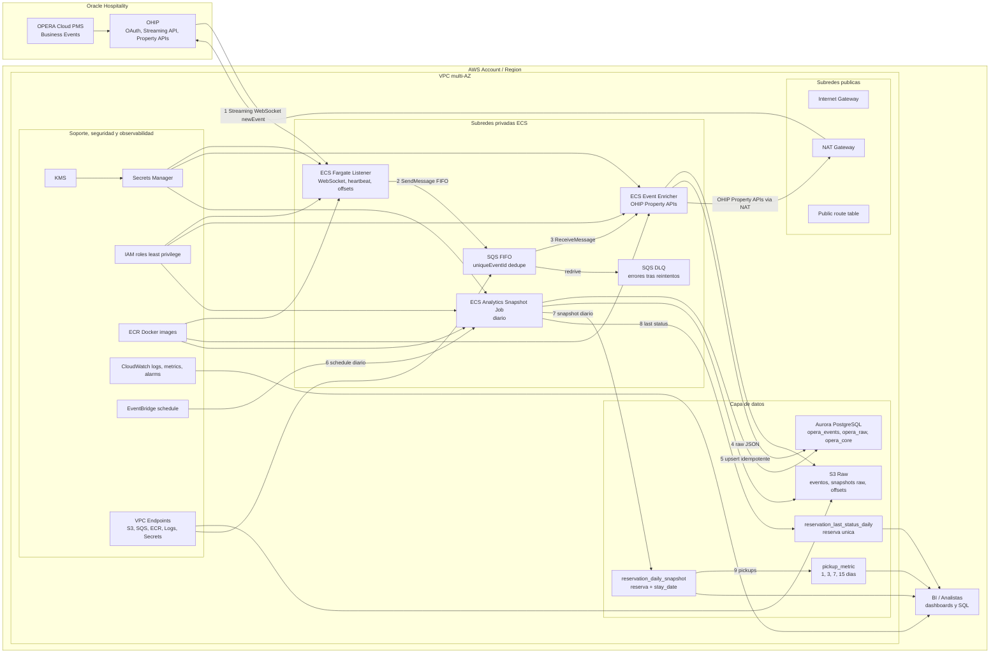
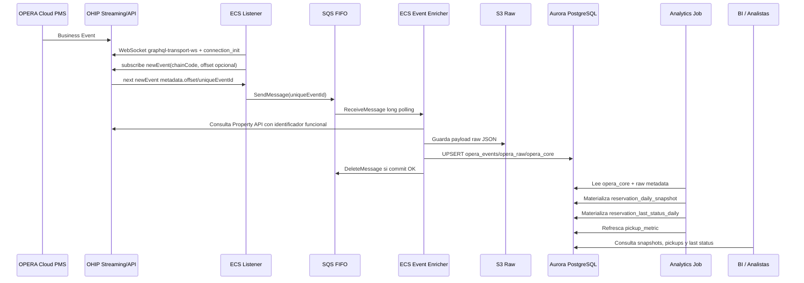

# Diagrama detallado de infraestructura y flujos

## Secuencia principal

El listener usa `wss://<gateway>/subscriptions?key=<sha256 application key>`, envia `connection_init` con `Authorization` y `x-app-key`, mantiene `ping/pong` cada 15 segundos y envia `complete` antes de cerrar una suscripcion. Para evitar `4409`, no ejecutes dos listeners contra el mismo `applicationKey + gateway URL + chainCode`.
