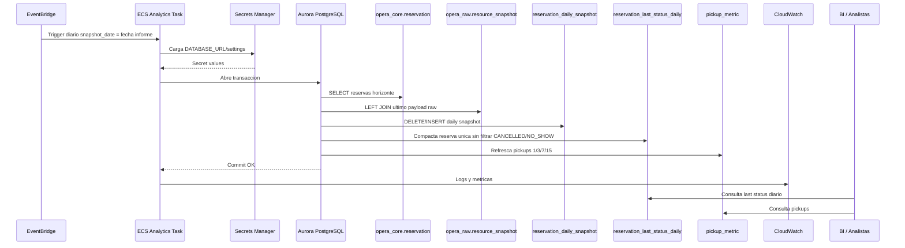
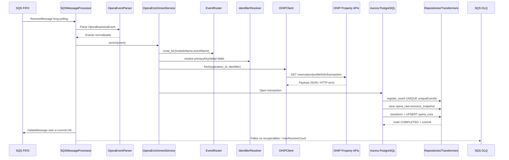
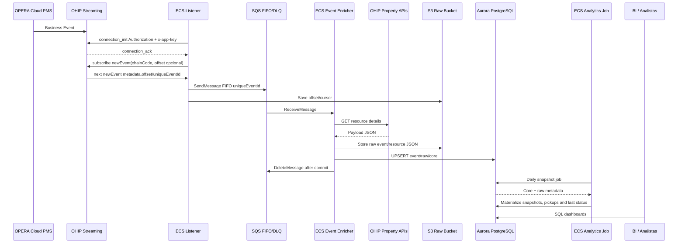

# Diagramas de secuencia actualizados

## Secuencia analitica



## Secuencia event-enricher



## Secuencia general end-to-end



## Secuencia ECS listener

```mermaid
sequenceDiagram
    participant ECS as ECS Task listener.py
    participant SEC as Secrets Manager
    participant HM as Health/Metrics
    participant OFF as S3OffsetStore
    participant OAUTH as OAuthClient
    participant TOKEN as OHIP Token Endpoint
    participant WS as OHIP Streaming WebSocket
    participant PARSE as parse_ohip_event
    participant SQS as SQS FIFO
    participant CW as CloudWatch

    ECS->>SEC: load_secret_into_environment
    SEC-->>ECS: OHIP credentials + config
    ECS->>HM: start /live /ready + metrics
    ECS->>OFF: load(subscription_name)
    OFF-->>ECS: last offset / uniqueEventId
    ECS->>OAUTH: request access token
    OAUTH->>TOKEN: client_credentials
    TOKEN-->>OAUTH: access_token
    ECS->>WS: open wss /subscriptions?key=sha256(app key)
    ECS->>WS: connection_init Authorization + x-app-key
    WS-->>ECS: connection_ack
    ECS->>WS: subscribe newEvent(chainCode, offset opcional)
    ECS->>WS: ping cada 15s
    WS-->>ECS: pong / next events
    ECS->>PARSE: parse raw event
    ECS->>SQS: publish with MessageDeduplicationId=uniqueEventId
    ECS->>OFF: save offset + uniqueEventId
    ECS->>CW: metrics/logs last_event_timestamp
    ECS->>WS: complete con subscription id antes de cerrar
    WS-->>ECS: disconnect/error
    ECS->>WS: reconnect exponential backoff + jitter
```

Notas Oracle Streaming:

- Solo debe existir una suscripcion activa por `applicationKey + gateway URL + chainCode`.
- Si el listener no reconecta en 24 horas, debe enviar el ultimo `offset` guardado.
- OHIP conserva eventos para replay durante 7 dias.
