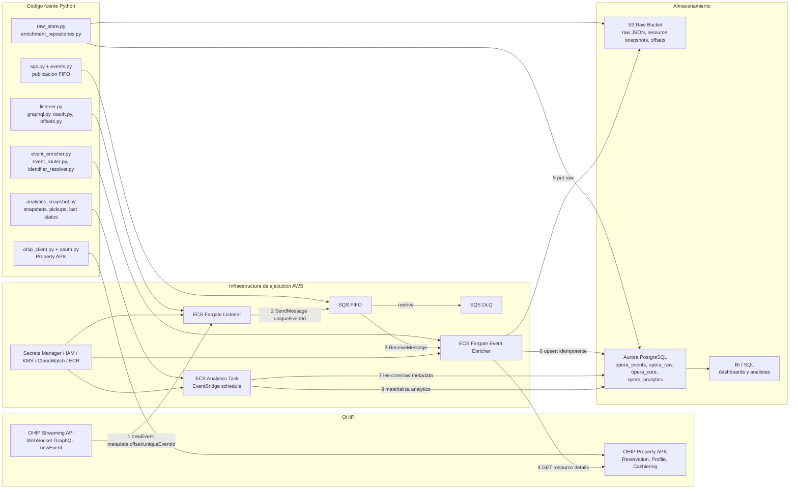
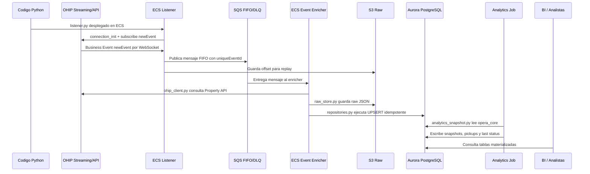

# Flujo codigo fuente - infraestructura - OHIP - almacenamiento

```mermaid
flowchart LR
    subgraph SRC["Codigo fuente Python"]
        LISTENER_PY["listener.py<br/>graphql.py, oauth.py, offsets.py"]
        SQS_PY["sqs.py + events.py<br/>publicacion FIFO"]
        ENRICHER_PY["event_enricher.py<br/>event_router.py, identifier_resolver.py"]
        OHIP_PY["ohip_client.py + oauth.py<br/>Property APIs"]
        STORE_PY["raw_store.py<br/>enrichment_repositories.py"]
        ANALYTICS_PY["analytics_snapshot.py<br/>snapshots, pickups, last status"]
    end

    subgraph RUN["Infraestructura de ejecucion AWS"]
        ECS_LISTENER["ECS Fargate Listener"]
        FIFO["SQS FIFO"]
        DLQ["SQS DLQ"]
        ECS_ENRICHER["ECS Fargate Event Enricher"]
        ECS_ANALYTICS["ECS Analytics Task<br/>EventBridge schedule"]
        SUPPORT["Secrets Manager / IAM / KMS / CloudWatch / ECR"]
    end

    subgraph EXT["OHIP"]
    STREAM["OHIP Streaming API<br/>WebSocket GraphQL newEvent"]
        PROPERTY["OHIP Property APIs<br/>Reservation, Profile, Cashiering"]
    end

    subgraph DATA["Almacenamiento"]
        S3["S3 Raw Bucket<br/>raw JSON, resource snapshots, offsets"]
        PG["Aurora PostgreSQL<br/>opera_events, opera_raw, opera_core, opera_analytics"]
        BI["BI / SQL<br/>dashboards y analistas"]
    end

    LISTENER_PY --> ECS_LISTENER
    SQS_PY --> FIFO
    ENRICHER_PY --> ECS_ENRICHER
    OHIP_PY --> PROPERTY
    STORE_PY --> S3
    STORE_PY --> PG
    ANALYTICS_PY --> ECS_ANALYTICS

    STREAM -- "1 newEvent metadata.offset/uniqueEventId" --> ECS_LISTENER
    ECS_LISTENER -- "2 SendMessage uniqueEventId" --> FIFO
    FIFO -- "3 ReceiveMessage" --> ECS_ENRICHER
    FIFO -- "redrive" --> DLQ
    ECS_ENRICHER -- "4 GET resource details" --> PROPERTY
    ECS_ENRICHER -- "5 put raw" --> S3
    ECS_ENRICHER -- "6 upsert idempotente" --> PG
    ECS_ANALYTICS -- "7 lee core/raw metadata" --> PG
    ECS_ANALYTICS -- "8 materializa analytics" --> PG
    PG --> BI
    SUPPORT --> ECS_LISTENER
    SUPPORT --> ECS_ENRICHER
    SUPPORT --> ECS_ANALYTICS
```

## Secuencia operativa

```mermaid
sequenceDiagram
    participant SRC as Codigo Python
    participant OHIP as OHIP Streaming/API
    participant LIS as ECS Listener
    participant SQS as SQS FIFO/DLQ
    participant ENR as ECS Event Enricher
    participant S3 as S3 Raw
    participant PG as Aurora PostgreSQL
    participant JOB as Analytics Job
    participant BI as BI / Analistas

    SRC->>LIS: listener.py desplegado en ECS
    LIS->>OHIP: connection_init + subscribe newEvent
    OHIP->>LIS: Business Event newEvent por WebSocket
    LIS->>SQS: Publica mensaje FIFO con uniqueEventId
    LIS->>S3: Guarda offset para replay
    SQS->>ENR: Entrega mensaje al enricher
    ENR->>OHIP: ohip_client.py consulta Property API
    ENR->>S3: raw_store.py guarda raw JSON
    ENR->>PG: repositories.py ejecuta UPSERT idempotente
    JOB->>PG: analytics_snapshot.py lee opera_core
    JOB->>PG: Escribe snapshots, pickups y last status
    BI->>PG: Consulta tablas materializadas
```
