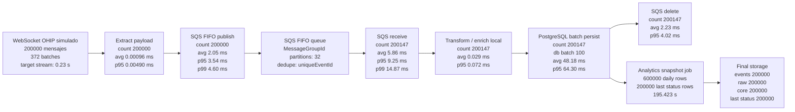

# E2E concurrente OPERA OHIP - 200000 registros

Reporte fuente: `outputs/streaming-e2e-concurrent-200000-report.json`

## Configuracion

| Parametro | Valor |
|---|---:|
| Mensajes simulados desde WebSocket | 200000 |
| Realtime | true |
| Min seconds / max seconds | 0.1 / 0.5 |
| Min batch / max batch | 100 / 1000 |
| Batches simulados | 372 |
| Batch medio | 537.63 |
| Worker count | 8 |
| Worker concurrency | 4 |
| Workers efectivos | 32 |
| DB batch size | 100 |
| SQS batch size | 10 |
| MessageGroupId partitions | 32 |

## Resultado global

| Metrica | Valor |
|---|---:|
| Tiempo total E2E | 1104.025 s |
| Tiempo total E2E | 18 min 24.025 s |
| Mensajes finales procesados | 200000 |
| Throughput E2E total | 181.16 msg/s |
| Tiempo streaming + SQS + PostgreSQL core | 908.602 s |
| Throughput antes de analytics | 220.12 msg/s |
| Tiempo analytics final | 195.423 s |
| Peso de analytics sobre el total | 17.70% |
| Tamano final DB | 698.6 MB |

## Grafo del flujo con tiempos

## Tabla por punto de infraestructura

Los `total_s` de cada etapa son coste agregado de operaciones, no tiempo de pared acumulable, porque el test usa 32 workers efectivos y varias etapas corren en paralelo.

| Punto | Count | Total agregado | Avg | P50 | P95 | P99 | Max |
|---|---:|---:|---:|---:|---:|---:|---:|
| WebSocket simulated extract | 200000 | 0.192 s | 0.00096 ms | 0.00044 ms | 0.00490 ms | 0.00640 ms | 0.12039 ms |
| SQS FIFO publish | 200000 | 410.301 s | 2.05151 ms | 1.82731 ms | 3.53995 ms | 4.59963 ms | 851.51288 ms |
| SQS FIFO receive | 200147 | 1173.431 s | 5.86285 ms | 5.34830 ms | 9.25217 ms | 14.86635 ms | 1234.42929 ms |
| Local transform / enrich | 200147 | 5.803 s | 0.02899 ms | 0.02248 ms | 0.07194 ms | 0.10064 ms | 1.61170 ms |
| PostgreSQL batch persist | 200147 | 9643.355 s | 48.18136 ms | 46.57284 ms | 64.30302 ms | 80.86273 ms | 392.67201 ms |
| SQS FIFO delete | 200147 | 445.788 s | 2.22730 ms | 1.89524 ms | 4.01959 ms | 6.20654 ms | 864.52002 ms |
| Analytics snapshot final | 1 | 195.423 s | 195422.94610 ms | 195422.94610 ms | 195422.94610 ms | 195422.94610 ms | 195422.94610 ms |

## Tabla de inicio a fin

| Fase | Ventana estimada | Datos procesados al final | Observacion |
|---|---:|---:|---|
| WebSocket simulado -> SQS FIFO -> consumers -> PostgreSQL core/raw/events | 0.000 s - 908.602 s | 200000 events, 200000 raw snapshots, 200000 core reservations | Produccion y consumo corrieron en paralelo. |
| AnalyticsSnapshotJob | 908.602 s - 1104.025 s | 600000 daily snapshots, 200000 last status rows | Incluye snapshot diario, last status y pickups. |
| E2E completo | 0.000 s - 1104.025 s | 200000 mensajes finales | Throughput total: 181.16 msg/s. |

## Conteos finales en PostgreSQL

| Tabla / vista funcional | Filas |
|---|---:|
| `opera_events.event` con `COMPLETED` | 200000 |
| `opera_raw.resource_snapshot` | 200000 |
| `opera_core.reservation` | 200000 |
| `opera_analytics.reservation_daily_snapshot` | 600000 |
| `opera_analytics.reservation_last_status_daily` | 200000 |

## Recursos observados

| Recurso | Avg | Max |
|---|---:|---:|
| CPU | 19.46% | 29.17% |
| Memoria | 69.45% | 77.99% |
| Disco | 5.44% | 5.51% |
| Samples | 544 | - |

## Notas

- El flujo concurrente funciono: los consumidores estaban activos mientras el productor publicaba eventos simulados desde WebSocket.
- Las tablas finales cuadran exactamente en 200000 mensajes funcionales.
- Las etapas `sqs_receive`, `enrich_transform`, `db_batch_persist` y `sqs_delete` registran 200147 operaciones. Esas 147 operaciones extra son relecturas/duplicados operativos durante concurrencia; la idempotencia por `unique_event_id` dejo el resultado final correcto.
- El cuello principal sigue siendo PostgreSQL batch persist: avg 48.18 ms, p95 64.30 ms por registro medido.
- Analytics final escalo a 200000 tras la optimizacion de `last_status`: 195.423 s para 600000 filas diarias y 200000 filas de last status.
